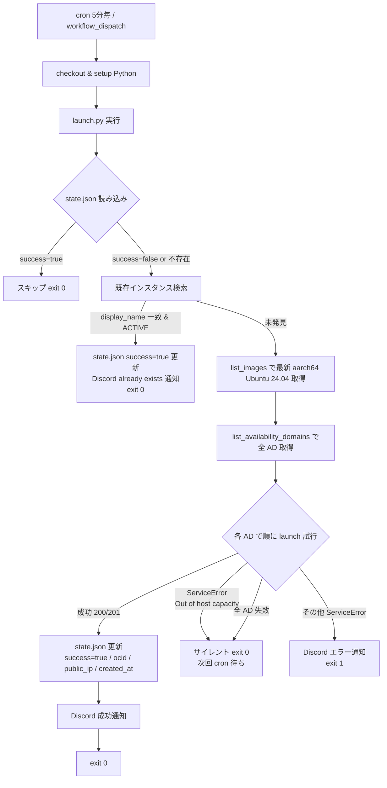
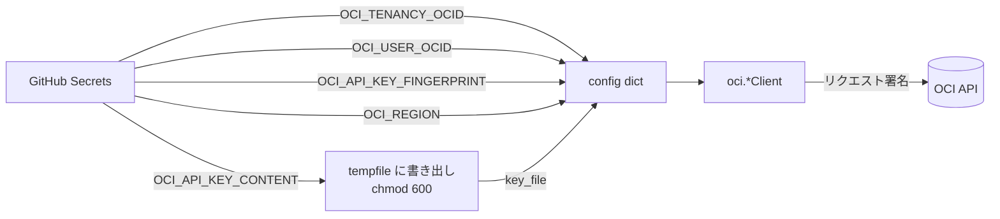
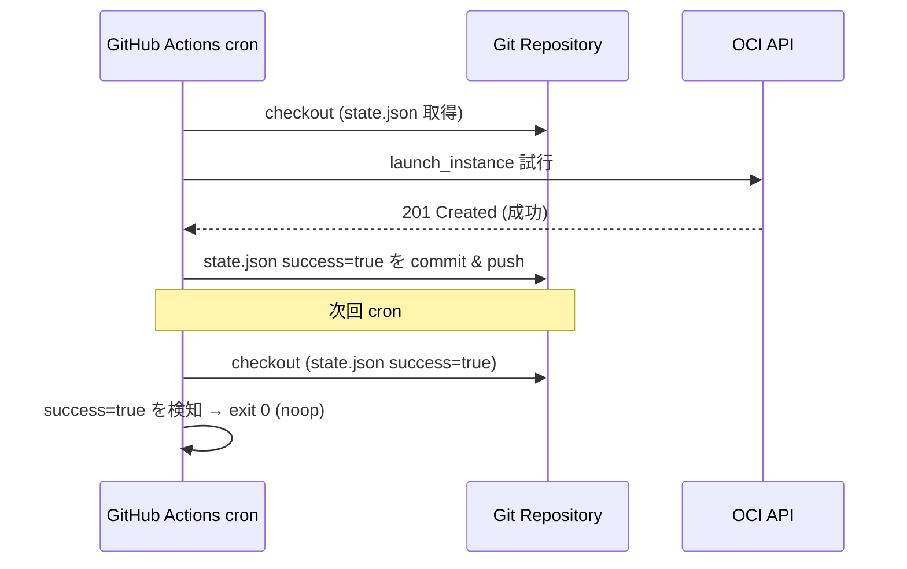
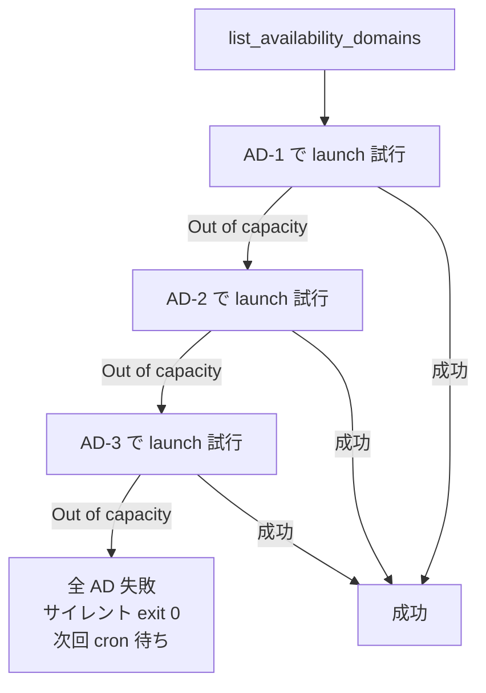

# アーキテクチャ

OCI Always Free Auto-Retry の設計・アーキテクチャ解説。

---

## 1. 全体フロー



---

## 2. OCI 認証の仕組み (API キー認証)

OCI Python SDK は API キー認証を使用する。本ツールでは PEM 秘密鍵の**内容**を GitHub Secret `OCI_API_KEY_CONTENT` で渡し、CI 実行時に一時ファイルに書き出して SDK の `key_file` として利用する。



### 認証に必要な情報

| 項目 | 取得元 |
|---|---|
| tenancy OCID | OCI コンソール Tenancy ページ |
| user OCID | OCI コンソール User ページ |
| fingerprint | API キー追加時に発行 |
| region | デプロイ先リージョン |
| 秘密鍵 (PEM) | API キー追加時にダウンロード |

> 秘密鍵ファイルは `.gitignore` で `*.pem` を除外済み。リポジトリに commit されない。

---

## 3. state.json による成功後の自動 noop 化

`state.json` は起動成功状態を記録する小さな JSON ファイル。ワークフローは毎実行後にこれを `git add -f` → commit → push し、次回以降の cron 実行で `success: true` を読み込むことで**無駄な launch 試行をスキップ**する。



### state.json フォーマット

```json
{
  "success": false,
  "instance_ocid": null,
  "public_ip": null,
  "created_at": null,
  "last_attempt_at": "2026-07-05T03:00:00+00:00",
  "last_error": null,
  "attempt_count": 0
}
```

- `success`: true になると次回以降スキップ。
- `instance_ocid` / `public_ip` / `created_at`: 成功時に記録。
- `last_attempt_at` / `attempt_count`: デバッグ用。毎回更新。
- `last_error`: 直近のエラー。Out of capacity の場合は記録されるが exit 0。

### なぜ `.gitignore` に state.json を入れているか

ローカル開発時に誤って個人の state.json を commit するのを防ぐため。CI では `git add -f` で強制 add して commit する。state.json 自体には秘密鍵等のシークレットは含まれない (instance OCID / public IP / タイムスタンプのみ)。

---

## 4. AD ローテーション戦略



- **毎回リスト順** で試行する (Round-robin ではない)。
- 1回でも成功すれば state.json が success になり次回からスキップ。
- 全 AD で Out of capacity の場合はサイレントに exit 0 し、5分後の cron で再試行。

---

## 5. 例外処理フロー

```mermaid
flowchart TD
    L[launch_instance] -->|200/201| OK[成功: state 更新 + Discord 通知]
    L -->|ServiceError| C{code 判定}
    C -->|InternalError + "Out of host capacity"| S1[サイレント exit 0]
    C -->|500 + "Out of capacity"| S1
    C -->|その他| ERR[Discord エラー通知 + exit 1]
    L -->|予期しない例外| LOG[ログ出力 + exit 1]
```

### Out of capacity 判定ロジック

`_is_out_of_capacity()` で以下を判定:

1. `code == "InternalError"` AND `message` に `"out of host capacity"` 含む
2. `status == 500` AND `message` に `"out of capacity"` 含む
3. `message` に `"out of host capacity"` 含む (フォールバック)

これらは「通常のリソース枯渇」であり、5分毎 cron で連投される Discord 通知を避けるため**サイレントに exit 0** する。

---

## 6. コスト

### GitHub Actions

- **無料枠**: public リポジトリは無制限、private リポジトリは月 2000 分無料 (Linux)。
- 本ワークフローは 1回あたり数秒〜数十秒 (Out of capacity の即時失敗) で終わる。
- 5分毎 × 288回/日 × 30日 = 8640回/月。1回平均 10秒として 1440分/月。**無料枠内**。
- 成功後は state.json が success になり noop (数秒) になるため、実質コストは更に下がる。

### OCI Always Free

- `VM.Standard.A1.Flex`: テナンシあたり **4 OCPU / 24 GB RAM** まで Always Free。
- 本ツールは 2 OCPU / 12 GB を要求するため、Always Free 枠内。
- ブートボリュームは Always Free で 200 GB まで (本ツールは 50 GB)。

---

## 7. セキュリティ考慮

| 項目 | 対策 |
|---|---|
| 秘密鍵の漏洩 | GitHub Secrets 経由のみ。`.gitignore` で `*.pem` / `.env` 除外。 |
| OCID のハードコード | **完全禁止**。全て環境変数 (`os.environ.get`) 経由。 |
| 一時ファイルの権限 | PEM 書き出し時に `chmod 600`。 |
| Discord Webhook | Secret 経由。通知内容にシークレットは含めない。 |
| state.json | シークレット非含有 (OCID / IP / タイムスタンプのみ)。 |
| GITHUB_TOKEN 権限 | `contents: write` のみ (state.json commit 用)。 |

---

## 8. 拡張ポイント

- **複数インスタンス**: state.json を配列化し、複数 display_name を管理。
- **他リージョン**: workflow matrix で複数リージョン同時試行。
- **通知先拡張**: Slack / Email 追加 (Discord 関数を抽象化)。
- **AD ランダム化**: 現状はリスト順。偏りを避けるなら round-robin に変更可。